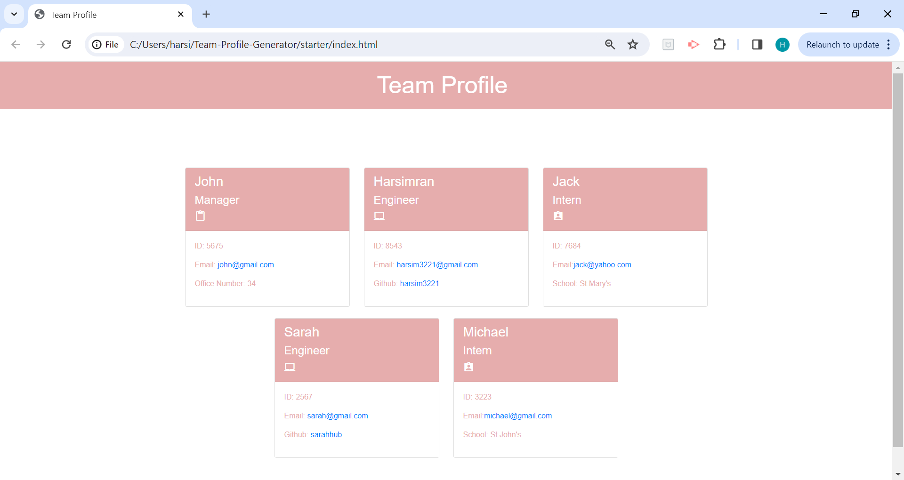

# Team-Profile-Generator

# User Story :

As a manager a user want to generate a webpage that displays my team's basic info so that a user have quick access to their emails and GitHub profiles.

# Description of the Project :

This application was created to generate a Team Profile based on user input using the Inquirer module from Node.js and displaying the information on a newly created html page with a style sheet. This project demonstrates use of OOP and TDD using Jest.

# Installation :

The user should download Node. This application also requires a file system, inquirer and Jest module to install.

# Usage :

Use inquirer from your command line to answer the questions about your project.

# Tests :

Run npm test to run Jest for tests on constructors.

# Profile : 

 
